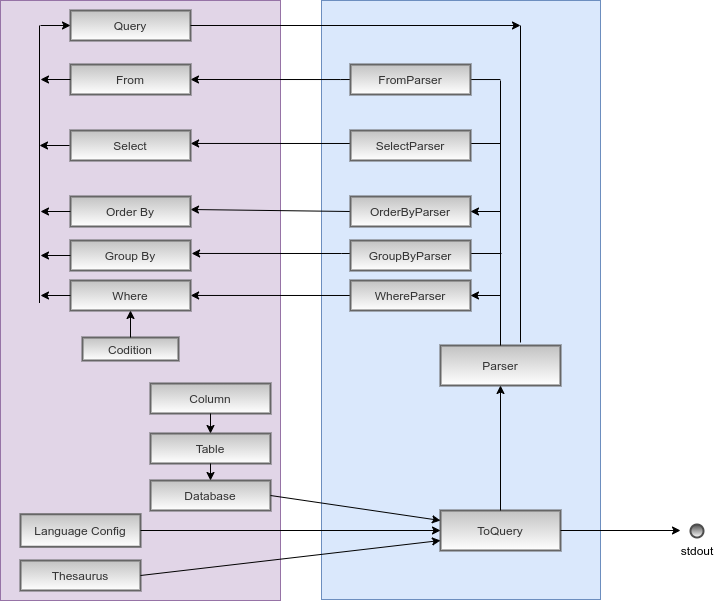

# Spreadsheet Information Retrieval
----
Our python script is an intelligent layer on top of a spreadsheet, which provides an alternative interaction method via Natural Language. 
Hence, instead of having to navigate menus, a user can simply describe his/her query in a natural language and get the required results faster.

### Usage
----
You can directly use the python wrapper by the following way:
```
Usage:
	python ln2sql.py -d <path> -i <input-sentence> [-l <path>] 
	[-t <path>] [-j <path>]
Parameters:
	-h					    print this help message
	-d <path>				path to sql dump file
	-i <input-sentence>		input sentence to parse
	-l <path>				path to language configuration file
	-j <path>				path to JSON output file
	-t <path>				path to thesaurus file
```
Example of usage:
```
python ln2sql.py -d database/city.sql -l lang/english.csv -j 
output.json -i "how many city there are in which the employee name
is similar to aman ?"
```
**NOTE**: Our code requires [Python](https://www.python.org/) v3.4+ to run. 

### Working
----
<p align="center"></p>

### Future Works
----
 - Use the segmented select, from, and where clauses to form a valid SQL query.
 - Run the SQL queries using a pandas script on the spreadsheet and output the results.
 - Incorporate a user-intuitive GUI for the functionality.
 - Provide support for additional SQL statements like aggregate functions, joins, etc.

### Authors
----
- Devaishi Tiwari (170101021)
- Soumik Paul (170101066)
- Utkarsh Mishra (170101083)
- Deepak Gami (170101020)

### References
----
- **[FMM09]** Derek Flood, Kevin McDaid, and Fergal McCaffery. “**NLP-SIR: A Natural Language Approach for Spreadsheet Information Retrieval**”. [**Paper Link**](http://arxiv.org/abs/0908.1193)

- **[GM14]** Sumit Gulwani and Mark Marron. “**Interactive Programming by Natural Language for SpreadSheet Data Analysis and Manipulation**”. [**Paper Link**](https://www.microsoft.com/en-us/research/publication/nlyze-interactive-programming-natural-languagespreadsheet-data-analysis-manipulation/)